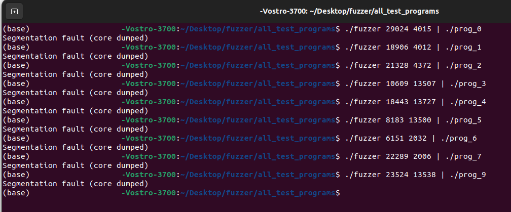

# Applied Security Demonstrations

## Overview
This project showcases hands-on implementations of applied security techniques, including cryptographic ciphers, network spoofing, and fuzz testing. It was developed to illustrate practical offensive security concepts and demonstrate the impact of software vulnerabilities.

---

## Key Features
- **Caesar Cipher**
  - Simple substitution cipher for encrypting and decrypting uppercase text files.
- **Esper Cipher**
  - Custom cipher combining rotation and XOR transformations with randomized keys.
- **UDP Spoofing Script**
  - Sends spoofed UDP packets using Scapy to simulate network attacks.
- **Fuzzer**
  - C-based fuzzer that generates pseudo-random input streams to trigger crashes in target programs.

---

## Screenshots

### Fuzzer Execution


---

## Technologies Used
- Python 3
- C
- Scapy
- GCC
- Linux command line tools

---

## How to Build and Run

1. **Clone the repository:**
    ```bash
    git clone https://github.com/ChadNetwig/applied-security-demos.git
    cd applied-security-demos
    ```

2. **Compile the fuzzer:**
    ```bash
    gcc fuzzer.c -o fuzzer
    ```

3. **Run the Fuzzer:**
    ```bash
    ./fuzzer <prng_seed> <num_iterations> | ./target_program
    ```

4. **Run the UDP Spoofing Script:**
    ```bash
    sudo python3 udp-flag-final.py
    ```

5. **Use the Caesar Cipher:**
    - Encrypt:
      ```bash
      python3 Caesar.py -e plaintext.txt -o ciphertext.txt
      ```
    - Decrypt:
      ```bash
      python3 Caesar.py -d ciphertext.txt -o plaintext.txt
      ```

6. **Use the Esper Cipher:**
    - Encrypt:
      ```bash
      python3 Esper.py -e plaintext.txt -o ciphertext.txt
      ```
    - Decrypt:
      ```bash
      python3 Esper.py -d ciphertext.txt -o plaintext.txt
      ```

---

## Important Notes
- This code is for demonstration and educational purposes only.
- The UDP spoofing script requires root privileges and should **never** be used on unauthorized networks.
- Cryptographic implementations are simplified and not secure for production use.

---

## License
This project is shared for educational and illustrative purposes. No warranty is provided.
